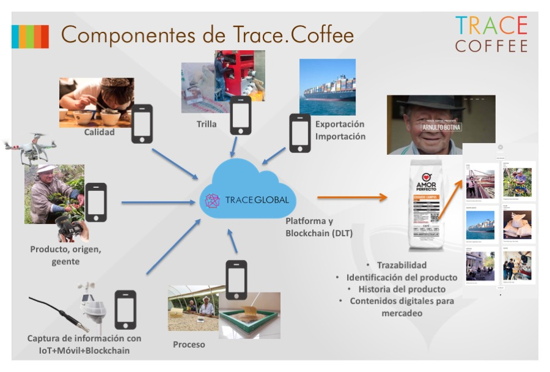
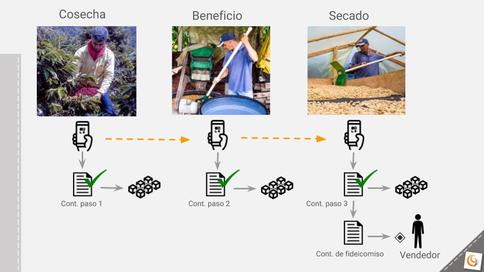

# Hackathon Blockchain Summit Latam 2018 Bogotá

## Automatic Payments Along the Coffee Supply Chain

The Meridian Group team decided participate in the Blockchain Summit Latam 2018 Bogotá Hackathon by focusing on the MakerDAO challenge, working on a solution to the problem of generating automatic and reliable payments along different steps of the coffee supply chain. To accomplish this we extended components of the Trace.Coffee traceability platform with smart contracts to store Dai funds and to trigger payments to players in the coffee trade as coffee moves along the production process and supply chain.

### The problem: 
In the process of buying coffee there is a trust issue between the buyers and the producers. Producers need capital to finance the harvests but the buyers are not willing to pay until they have received the product. This is because buyers need to make sure that at the end of the process the coffee is delivered and that it has the expected quality. Producers run the risk of not receiving the agreed payment when the product is ready because it may not meet the expectations of the buyers or because the buyers are not trustworthy (fraud intention).

### The solution: 
To solve this problem we proposed a mechanism based on the Dai cryptocurrency and the Ethereum blockchain. At the beginning of the process the buyer deposits the agreed payment in Dai, but the money is guarded by an Escrow smart contract that makes partial automatic payments to the producer as the stages of coffee production are completed and as the appropriate quality conditions are met in each step. The triggers of these payments are Verification smart contracts that get called when the Trace.Coffee traceability platform gets progress updates. At every update the smart contracts validate that the information complies with pre-defined completion and quality criteria. The Trace.Coffee platform uses a mobile app to report progress at each important step of the process. An agent (such as the producer) fills out forms in the mobile app, with information for the specific step (harvest, washing, drying, milling, etc.), including photos, QR codes, measurements and text. In addition to calling the Verification smart contracts, the key data of each process step is stored in the blockchain for audit and certification purposes.

#### Trace.Coffee Components

### The process - Step by Step:
1. The buyer and the producer agree on a price for the coffee
2. The buyer makes the full payment in Dai, but the funds are not given to the producer. Instead they remain stored in an Escrow smart contract.
3. The producer finishes a stage of the coffee production.
4. The producer uses the Trace.Coffee mobile app to report the information, photos and other possible proof that will give testimony of the progress and the quality reached in that stage. 
5. The data is sent by the mobile app to the Trace.Coffee backend.
6. The Trace.Coffee backend calls the Verification smart contract with the information received from the mobile app.
7. The Verification smart contract evaluates the information against predefined conditions. If the conditions are met, it calls the Escrow smart contract so that it makes a payment to the producer.
8. The key data is stored in the blockchain.
9. The buyer is notified via a Telegram chatbot about the progress.
10. Steps 3 to 9 are repeated for each coffee production stage until the process is finished, the product is delivered to the buyer and the producer (and potentially other agents in the coffee supply chain) receives the final payment automatically.

#### Automatic Payment Process

### Submitted Code:
The code in this repository is organized in the following folders:
* **SContracts**: contains the smart contracts code in Solidity.
* **TraceCoffeeBackend**: contains the source files belonging to the traceability platform's back-end which were modified for this project. The Trace.Coffee back-end is a server based on the LoopBack Node.js API framework. Only the javascript file containing the code that gets called when a new update comes from the mobile app is included here, in order to illustrate the connection between the process update mechanism and the smart contract.
* **ChatBot**: contains the code for the Telegram chatbot.
